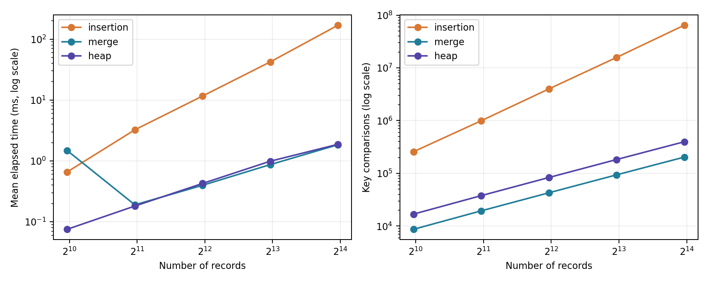
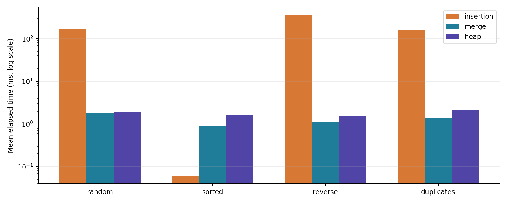

# 정렬 알고리즘 비교 보고서

고급알고리즘 과제 1 | 삽입 정렬 · 병합 정렬 · 힙 정렬

김무선 / 2026193106 / 2026년 9월 30일

## 1. 실험 목적과 선택 이유

배운 정렬로 삽입 정렬과 병합 정렬을, 배우지 않은 정렬로 힙 정렬을 선택하였다. 삽입 정렬은 입력의 정렬 상태에 민감하고, 병합 정렬은 분할과 병합으로 처리하며, 힙 정렬은 최대 힙을 이용한다. 세 방법을 비교하여 입력 크기와 형태가 성능에 미치는 영향, 추가 공간과 안정성의 차이를 확인하였다.

## 2. 알고리즘 원리와 이론적 특성

삽입 정렬은 앞부분을 정렬된 상태로 유지하면서 다음 원소를 알맞은 위치에 넣는다. 앞의 값이 현재 값보다 클 때만 이동시키므로 같은 키의 순서가 유지된다. 이미 정렬된 입력은 원소당 한 번의 비교로 끝나지만 역순 입력은 많은 원소를 이동시킨다.

병합 정렬은 구간을 반으로 나누어 각각 정렬한 뒤 두 정렬 구간을 합친다. 이 구현은 길이 n의 임시 배열을 한 번 할당하며, 같은 키는 왼쪽 구간에서 먼저 가져온다. 이미 정렬된 구간의 병합을 생략하는 최적화는 적용하지 않았다.

힙 정렬은 배열을 최대 힙으로 만든 후 루트의 최댓값을 배열 끝으로 옮긴다. 힙의 범위를 줄이고 루트에서 아래로 내려가며 조건을 복원한다. siftDown을 반복문으로 구현하여 재귀 호출을 사용하지 않았다.

| 정렬 | 최선 | 평균 | 최악 | 추가 공간 | 안정성 |
| --- | --- | --- | --- | --- | --- |
| 삽입 | O(n) | O(n²) | O(n²) | O(1) | 안정 |
| 병합 | O(n log n) | O(n log n) | O(n log n) | O(n) | 안정 |
| 힙 | O(n)* | O(n log n) | O(n log n) | O(1) | 불안정 |

* 힙의 최선 O(n)은 이 구현에서 모든 키가 같아 siftDown이 즉시 멈추는 경우이다. 모든 키가 서로 다르다고 가정한 통상적인 힙 정렬 비교표에서는 최선도 O(n log n)으로 제시된다. 평균·최악 및 공간 특성은 동일하다.

---

# 3. AI를 이용한 힙 정렬 학습 자료

사용한 AI: ChatGPT / 학습 자료 작성일: 2026-09-30. 아래 문답은 과제 작성을 위해 AI가 제공한 학습용 설명이다. 핵심 내용은 참고자료 [3]과 구현·검사 결과를 함께 확인하였다.

## 학습 질문 1. 힙은 무엇이고 배열로 어떻게 표현하는가?

최대 힙은 부모의 키가 자식의 키보다 크거나 같은 완전 이진 트리이다. 형제끼리나 같은 깊이의 모든 원소가 정렬될 필요는 없으며, 루트가 최댓값이라는 성질을 이용한다. 0부터 시작하는 배열에서 i의 왼쪽 자식은 2i+1, 오른쪽 자식은 2i+2, 부모는 (i-1)/2의 정수 몫이다.

## 학습 질문 2. 왜 최댓값을 꺼내면 오름차순이 되는가?

최댓값을 앞쪽에 쌓는 대신 아직 정렬되지 않은 구간의 맨 뒤에 놓기 때문이다. 루트와 끝 원소를 교환하고 그 끝을 힙에서 제외하면, 뒤에는 확정된 큰 값이 남는다. 이후 다음 최댓값을 그 앞에 배치하므로 최종 배열은 오름차순이 된다.

| 단계 | 배열 상태 | 설명 |
| --- | --- | --- |
| 입력 | 4, 1, 3, 2 | 아직 힙이 아님 |
| 힙 구성 | 4, 2, 3, 1 | 각 부모가 자식 이상 |
| 4 확정 | 3, 2, 1 | 4 | 교환 후 앞 3개를 복원 |
| 3 확정 | 2, 1 | 3, 4 | 앞 2개를 복원 |
| 완료 | 1 | 2, 3, 4 | 오름차순 정렬 |

## 학습 질문 3. 시간과 공간 복잡도는 왜 그렇게 되는가?

마지막 내부 노드부터 아래 방향으로 힙을 구성하는 비용은 O(n)이다. 대부분의 노드가 바닥 가까이에 있어 이동 거리가 짧기 때문이다. 정렬 단계는 최대 n-1번의 추출과 최대 O(log n)의 복원으로 구성되어 최악 O(n log n)이다. 반복문과 원소 한 칸으로 교환하므로 추가 공간은 O(1)이다.

## 학습 질문 4. 힙 정렬은 왜 안정 정렬이 아닌가?

멀리 떨어진 루트와 끝 원소를 교환하면 같은 키의 원래 순서가 바뀔 수 있다. 예를 들어 모두 같은 키에 태그 0,1,2,3을 붙이면 이 구현의 결과 태그는 1,2,3,0이다. 값은 올바르게 정렬되지만 동일 키의 상대 순서는 보존되지 않는다.

학습 정리: 힙 조건은 전체 정렬 조건과 다르다. 힙 구성 O(n)과 정렬 전체 최악 O(n log n)을 구분해야 하며, 공간을 분석할 때 재귀 스택도 포함해야 한다.

---

# 4. 구현 및 실험 방법

## 4.1 코드 구성

| 파일 | 역할 |
| --- | --- |
| src/sort.h, sort.c | Record·통계·공통 함수 및 알고리즘 등록 |
| src/insertionSort.c | 삽입 정렬 |
| src/mergeSort.c | 임시 배열을 이용한 재귀 병합 정렬 |
| src/heapSort.c | 반복 siftDown을 이용한 힙 정렬 |
| src/main.c | 입력 생성, 시간 측정, 검증, CSV 출력 |
| tests/test_sort.c | 경계값·난수·안정성·카운터 검사 |

Record는 int key와 size_t original로 구성한다. 정렬 기준은 key만 사용하고 original은 입력 당시 위치를 기록한다. 세 함수는 같은 인자와 반환 형식을 사용하며 함수 포인터 목록으로 호출한다. 메모리 할당 실패 시 실패를 반환하고 실험을 중단한다.

## 4.2 실험 환경과 입력

실행 환경: Linux 6.18.44 / x86_64 / AMD EPYC 9V74 가상 실행 환경 / GCC 13.3.0. 빌드 옵션: -std=c17 -Wall -Wextra -Wpedantic -O2. sizeof(Record)는 16바이트였다. 실험은 2026-09-30 ChatGPT의 실행 환경에서 직접 수행하였다.

크기는 1,000·2,000·4,000·8,000·16,000개이다. 입력 형태는 무작위 정수(0~999,999), 오름차순, 내림차순, 중복 다수(0~9)이다. 난수는 고정 LCG와 조건별 시드 20260930+n+형태번호를 사용한다. 동일 조건에서는 원본 배열을 복사하여 세 정렬에 동일하게 제공한다.

## 4.3 측정 기준

CLOCK_MONOTONIC으로 경과 시간을 측정하였다. 조건별로 정렬마다 1회 예열 후 5회 측정하여 평균·최소·최댓값을 기록했다. 실행 순서는 반복마다 순환시켰다. 입력 생성·복사·결과 검증·출력은 측정에서 제외하고, 병합 정렬 내부의 임시 배열 할당과 해제는 포함했다.

시간 측정에는 통계 포인터 NULL을 전달한다. 비교·이동 횟수는 동일 입력에 대한 별도의 1회 실행에서 기록한다. 비교는 key끼리의 대소 비교만 센다. 이동은 임시 변수까지 포함한 Record 대입 1회를 의미하며 교환은 이동 3회이다. 루프와 인덱스 비교는 제외한다.

추가 바이트는 정렬용 데이터 버퍼만 센다. 입력·실험용 복사 배열·검증용 배열·카운터와 제어 변수는 제외한다. 병합의 재귀 스택 O(log n)은 바이트 수에 포함하지 않지만 총 공간 복잡도는 여전히 O(n)이다.

## 4.4 정확성 검증

624개 검사가 모두 통과하였다. 0~200 크기의 난수, 빈 배열, 한 원소, 역순, 중복, 모두 같은 값, INT_MIN·INT_MAX를 검사했다. qsort 결과의 키와 대조하고 태그로 원소 누락·중복을 확인했다. 안정 정렬의 태그 순서와 삽입 정렬 카운터도 확인했다. 매 실험 실행 결과에도 동일한 정확성 검증을 적용했다.

ASan·UBSan 검사도 통과했다. 실행 환경에서 LeakSanitizer의 프로세스 조회가 제한되어 detect_leaks=0으로 실행했으며, 이 결과는 누수 검사를 통과했다는 의미가 아니다.

---

# 5. 결과: 입력 크기에 따른 변화

표 1. 무작위 입력의 정렬 시간. 모든 단위는 ms이며 5회 산술평균이다.

| n | 삽입 평균 | 병합 평균 | 힙 평균 |
| --- | --- | --- | --- |
| 1,000 | 0.6567 | 1.4812 | 0.0751 |
| 2,000 | 3.2376 | 0.1896 | 0.1811 |
| 4,000 | 11.6195 | 0.3972 | 0.4258 |
| 8,000 | 42.2829 | 0.8689 | 0.9876 |
| 16,000 | 169.5156 | 1.8420 | 1.8730 |

표 2. 같은 무작위 입력의 key 비교 횟수. 시간과 별도로 측정했다.

| n | 삽입 비교 | 병합 비교 | 힙 비교 |
| --- | --- | --- | --- |
| 1,000 | 256,520 | 8,679 | 16,846 |
| 2,000 | 993,683 | 19,440 | 37,767 |
| 4,000 | 3,989,487 | 42,793 | 83,381 |
| 8,000 | 15,810,873 | 93,744 | 182,926 |
| 16,000 | 64,537,674 | 203,322 | 397,424 |

그림 1. 입력 크기와 시간·비교 횟수의 관계. 세 정렬을 함께 읽기 위해 로그 축을 사용했다.

n=16,000에서 삽입은 169.516 ms, 병합은 1.842 ms, 힙은 1.873 ms였다. 이 조건에서 병합은 삽입보다 약 92.0배, 힙은 약 90.5배 빨랐다.

8,000개에서 16,000개로 늘릴 때 삽입의 비교 횟수는 4.08배 증가했다. 이는 무작위 입력에서 O(n²) 증가 양상과 일치한다. 병합과 힙의 비교 횟수 증가는 이보다 작으며 O(n log n)과 부합한다. 유한한 크기의 실험만으로 복잡도를 증명할 수는 없다.

주의: n=1,000 병합의 최소 0.0551, 최대 7.1401 ms로 편차가 컸다. 이 조건의 평균만으로 병합이 힙보다 본질적으로 느리다고 판단할 수 없다. 작은 입력의 경과 시간은 스케줄링 영향을 크게 받는다.

---

# 6. 결과: 입력 형태와 공간·안정성

표 3. n=16,000, 평균 시간 [최소~최대], 단위 ms.

| 입력 형태 | 삽입 | 병합 | 힙 |
| --- | --- | --- | --- |
| 무작위 | 169.516
[166.730~173.868] | 1.842
[1.788~1.889] | 1.873
[1.814~1.935] |
| 오름차순 | 0.062
[0.061~0.065] | 0.881
[0.830~0.986] | 1.612
[1.526~1.706] |
| 내림차순 | 354.466
[346.048~374.758] | 1.101
[0.868~1.779] | 1.555
[1.453~1.798] |
| 중복 다수 | 161.010
[148.250~179.724] | 1.354
[1.296~1.474] | 2.103
[1.511~2.619] |

그림 2. n=16,000의 입력 형태별 평균 경과 시간. 세로축은 로그 축이다.

오름차순에서 삽입의 비교 횟수는 15,999=n-1이다. 내림차순에서는 127,992,000=n(n-1)/2회로 증가하였다. 입력의 정렬 상태가 삽입 정렬의 성능을 크게 바꾼다는 점을 확인했다. 중복 다수도 이 구현에서는 여전히 많은 이동을 요구했다.

병합은 모든 입력에서 구간을 나누고 병합하므로 이미 정렬된 입력에서도 같은 차수의 작업을 수행한다. 힙은 정렬된 입력에서도 힙 구성과 추출을 수행한다. 둘의 실제 속도 차이는 비교 횟수만으로 결정되지 않으며 이동, 메모리 접근 및 실행 편차가 함께 영향을 준다.

| 정렬 | 데이터 버퍼 추가량 | 중복 입력 안정성 관찰 |
| --- | --- | --- |
| 삽입 | 16 B (원소 한 칸) | 원래 순서 유지 |
| 병합 | 256,000 B (n칸) | 원래 순서 유지 |
| 힙 | 16 B (교환 한 칸) | 원래 순서 위반 |

표 4. n=16,000에서 측정한 버퍼 크기와 중복 입력 결과. 안정성은 정수 값만 보면 구분할 수 없으므로 original 태그를 사용했다. 일부 입력에서 힙의 태그가 유지되더라도 모든 입력의 안정성을 의미하지 않는다.

---

# 7. 결론과 한계

입력의 형태와 크기에 따라 적합한 정렬이 달라졌다. 삽입 정렬은 이미 정렬된 입력에서 빠르고 추가 공간도 작았지만 무작위와 역순에서 비교·이동 비용이 크게 증가했다. 병합 정렬은 큰 무작위 입력에서 좋은 성능과 안정성을 제공했으며 대신 길이 n의 임시 배열이 필요했다. 힙 정렬은 반복문으로 구현하면 O(1) 추가 공간과 최악 O(n log n)을 얻지만 안정성을 보장하지 않았다.

따라서 안정성이 필요하고 추가 메모리를 사용할 수 있다면 병합 정렬을, 추가 공간을 작게 유지하며 최악 성능을 제한하고 싶다면 힙 정렬을 고려할 수 있다. 이미 정렬되었거나 작은 입력은 삽입 정렬을 고려할 수 있다. 이번 측정만으로 모든 환경에서 특정 정렬이 가장 빠르다고 일반화하지 않았다.

## 7.1 실험의 한계

조건마다 한 가지 시드로 만든 배열을 5회 재사용하였다. 평균 시간은 반복 실행 편차를 보여 주지만 여러 독립 데이터셋의 평균은 아니다. 입력 크기는 최대 16,000개이며 다른 타입·분포·컴파일러·컴퓨터에서는 결과가 달라질 수 있다. 실행 환경의 스케줄링으로 일부 측정 편차가 컸다.

통계 포인터를 NULL로 전달하더라도 공통 함수 호출과 분기 비용은 남을 수 있다. 완전히 최적화된 라이브러리 구현과의 비교가 아니라 이 코드의 세 구현을 같은 빌드 조건에서 비교한 결과이다. 표의 바이트 수는 버퍼 크기이며 프로세스의 실제 메모리 사용량이나 모든 스택 공간을 측정한 값은 아니다.

## 7.2 재현 방법

make test: 정확성 검사 / make bench: report/results.csv 재생성. 시간 값은 재실행 시 달라질 수 있으나 동일 입력의 비교·이동 횟수는 같은 코드에서 재현된다. 보고서의 원본 표와 그래프는 CSV에서 생성하였다.

## 8. 참고자료 및 AI 사용

[1] 과제 안내: Compare sorting, 2026-2 고급알고리즘.
[2] 환경 및 보고서 구성 참고: 아래 GitHub 저장소. 알고리즘 코드와 측정 수치는 이 과제를 위해 별도로 작성·실행했다.
https://github.com/lec-algorithm/algorithm-env
https://github.com/lec-algorithm/hw1-sample-2026

[3] Sedgewick & Wayne, Algorithms, 4th edition, 2.4 Priority Queues.
https://algs4.cs.princeton.edu/24pq/
[4] 같은 자료, 2.2 Mergesort.
https://algs4.cs.princeton.edu/22mergesort/
[5] 과제에서 지정한 정렬 목록: Wikipedia, Sorting algorithm.
https://en.wikipedia.org/wiki/Sorting_algorithm#Comparison_of_algorithms

AI 사용 범위: ChatGPT를 이용한 힙 정렬 학습 설명, 코드 작성, 테스트·실험 실행, 결과 분석 및 보고서 작성 보조. 성능 표는 이번 실행에서 얻은 실제 CSV의 값이다.

## 9. 제출 저장소

GitHub 저장소 URL: https://github.com/kjgdl2525-gi/sorting-hw1
